# ☁️ Cloud Computing Case Study

## PS-71: 30-Minute Investor Deployment Challenge

[](https://docs.google.com/document/d/1TkUdz7NsQEkRDCmpPwqSxWbyQQQxKSabxW-ERdubAjA/edit?usp=sharing)

[](#)


### Student Information

**Name:** Ragini Singh
**Subject:** Cloud Computing
**Project Type:** Practical Case Study

---

# Problem Statement

A startup founder receives an unexpected call from an investor requesting a live demonstration of their product within **30 minutes**.

The engineering team must rapidly deploy their application on a cloud infrastructure and provide a working link before the investor meeting begins.

The challenge is to quickly create cloud infrastructure, configure the server, deploy the website, and make it publicly accessible while ensuring minimal cost.

---

# Objective

The objective of this case study is to demonstrate **rapid deployment of a web application using cloud computing services**.

This project focuses on deploying a simple HTML website using **AWS EC2, Linux, and Apache Web Server**.

---

# Technologies Used

| Technology           | Purpose                                   |
| -------------------- | ----------------------------------------- |
| AWS EC2              | Virtual server hosting                    |
| Linux (Amazon Linux) | Server operating system                   |
| Apache HTTP Server   | Web server for hosting website            |
| HTML                 | Frontend webpage                          |
| GitHub               | Project documentation and version control |

---

# Cloud Architecture

User Browser
↓
Internet
↓
AWS EC2 Instance
↓
Apache Web Server
↓
HTML Website

---

# Deployment Steps

### 1. Launch EC2 Instance

* Login to AWS Console
* Navigate to EC2 Dashboard
* Launch instance using **Amazon Linux AMI**
* Select instance type **t3.micro**

---

### 2. Connect to EC2 Server

Use **EC2 Instance Connect** to access the server terminal.

---

### 3. Update System

```
sudo yum update -y
```

---

### 4. Install Apache Web Server

```
sudo yum install httpd -y
```

---

### 5. Start Apache Service

```
sudo systemctl start httpd
sudo systemctl enable httpd
```

---

### 6. Create Website File

```
sudo nano /var/www/html/index.html
```

---

# HTML Code

```
<html>
<head>
<title>Cloud Deployment Demo</title>
</head>

<body style="text-align:center; font-family:Arial;">
<h1>Cloud Computing Case Study</h1>
<p>Website deployed on AWS EC2 Server</p>
<p>Student Name: Ragini Singh</p>
<p>Technology Used: AWS + Linux + Apache</p>
<p>Deployment Time: 30 Minutes</p>
</body>
</html>
```

---

### 7. Restart Apache Server

```
sudo systemctl restart httpd
```

---

### 8. Access Website

Open the EC2 **Public IP Address** in browser.

Example:

```
http://44.221.46.97
```

---

# Result

The website was successfully deployed on AWS EC2 using Apache Web Server.

The webpage became accessible through the public IP address of the EC2 instance, demonstrating rapid cloud deployment.

---

# Screenshots

## S3 Bucket Created

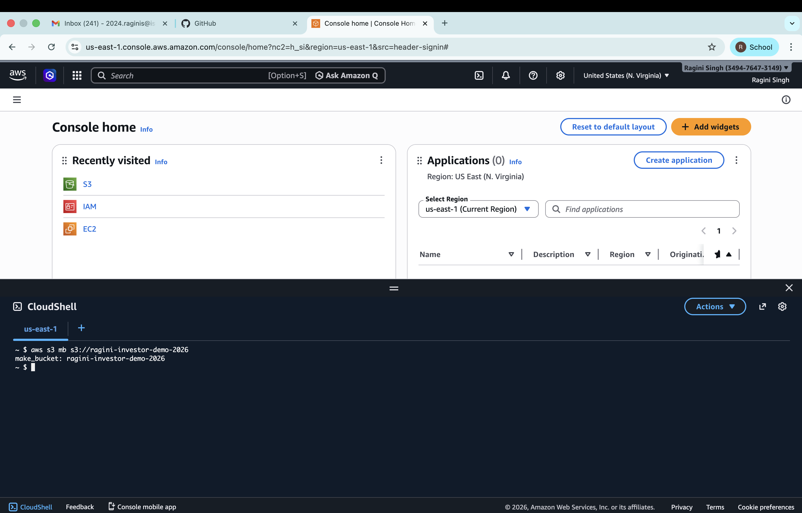

---

## AWS CloudShell Opened

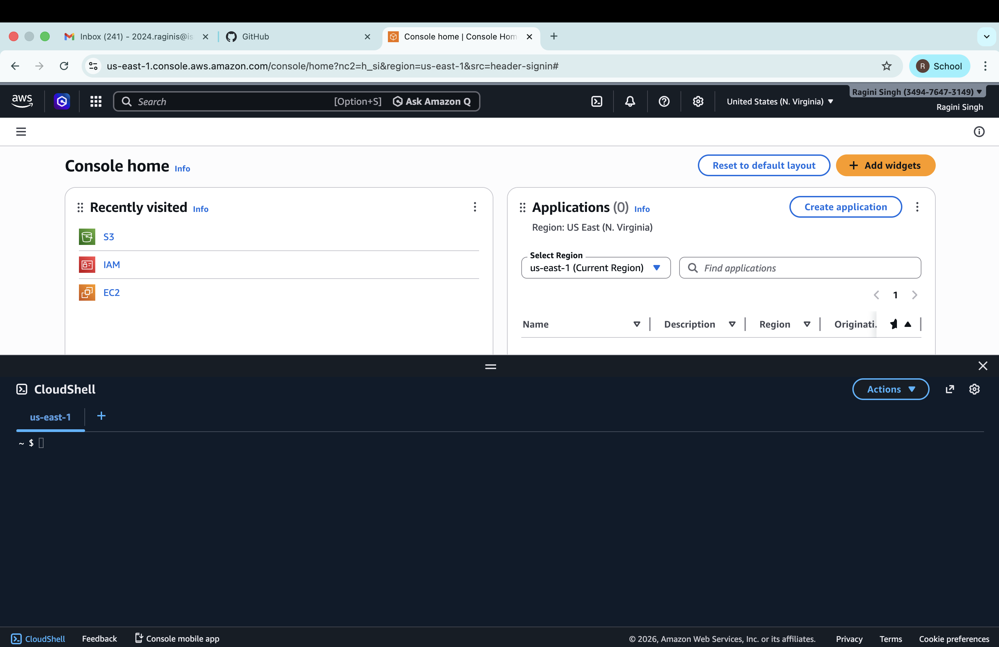

---

## EC2 Dashboard

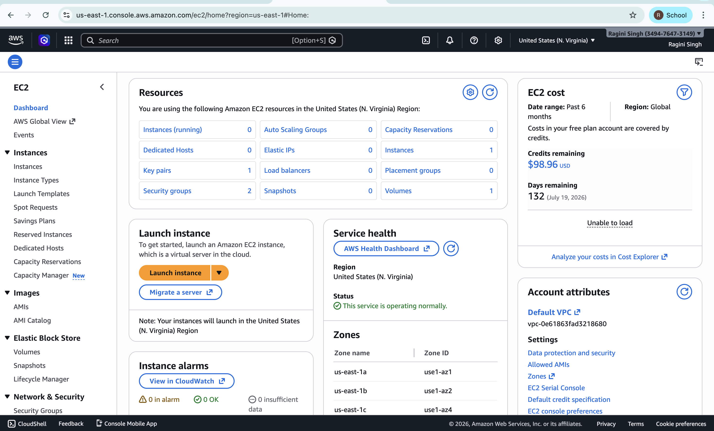

---

## HTML File Created

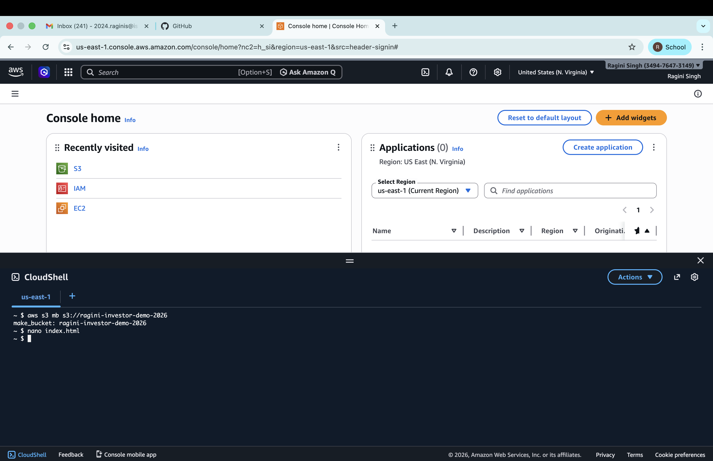

---

## HTML Uploaded to S3

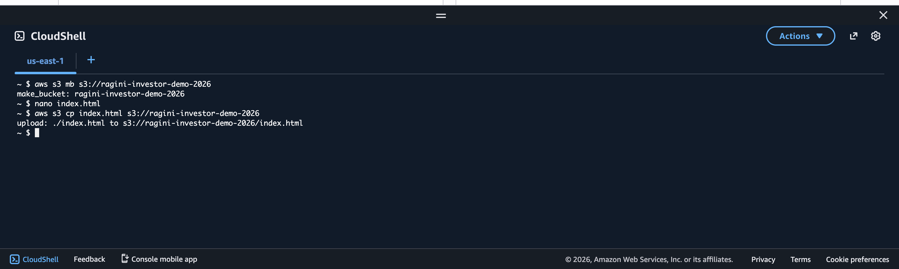

---

## Launch EC2 Instance

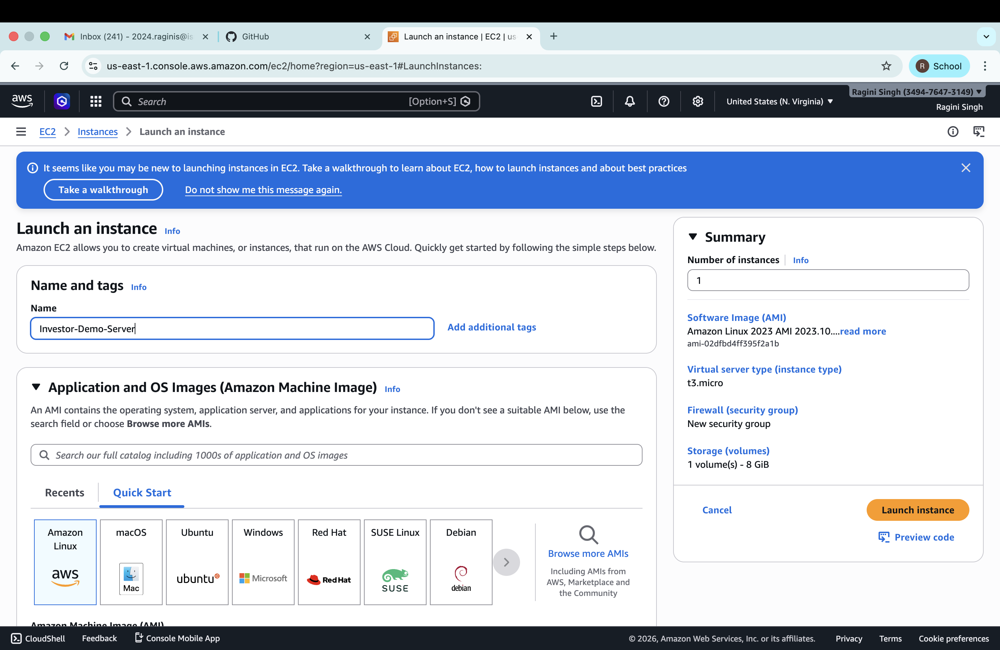

---

## Network Settings

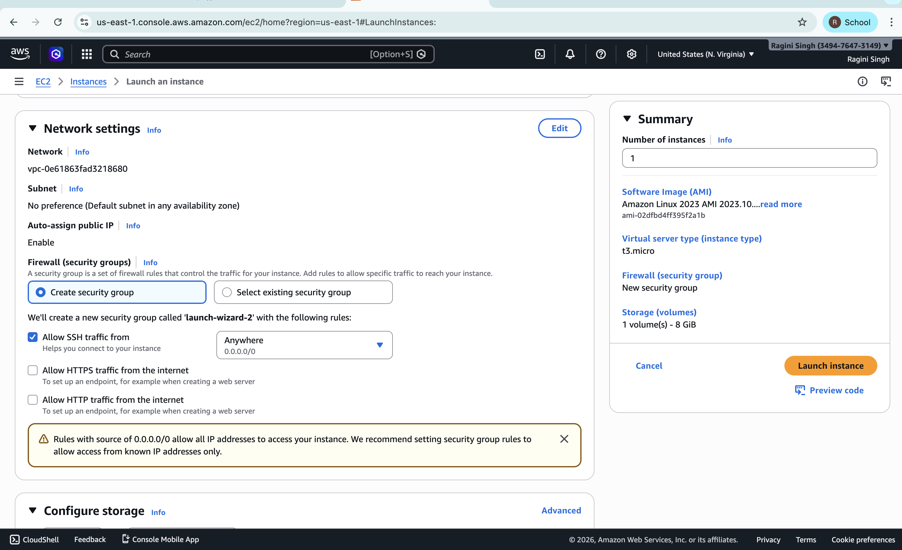

---

## Storage Settings

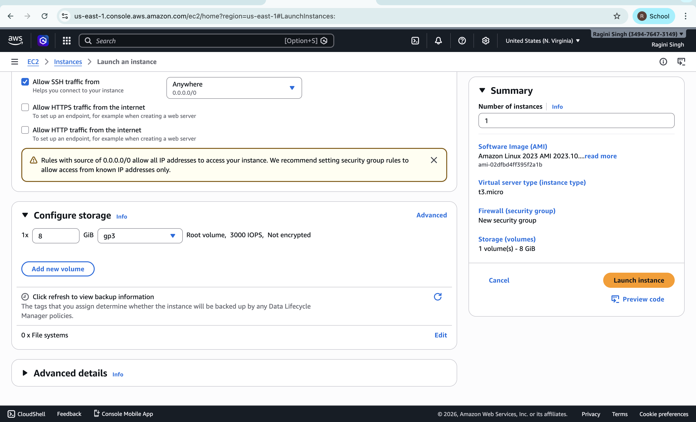

---

## Key Pair Created

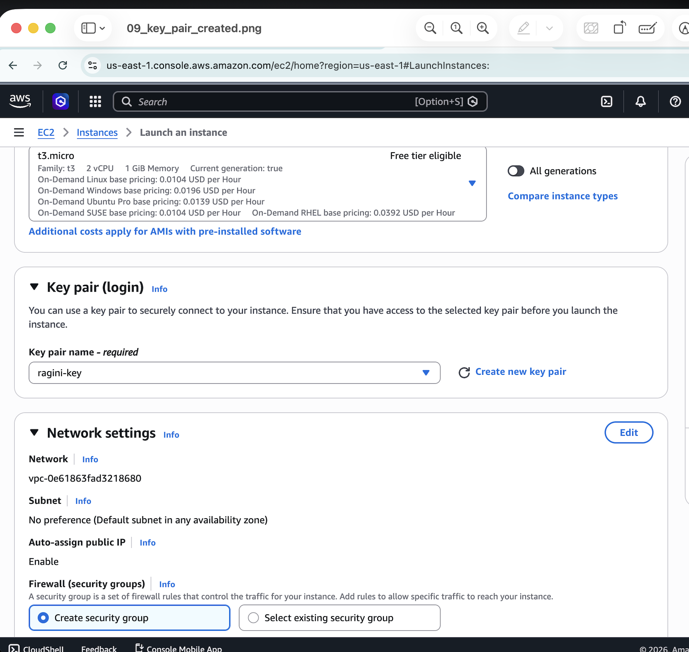

---

## EC2 Instance Launched

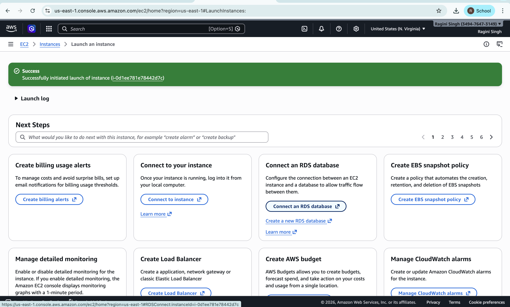

---

## EC2 Instance Running

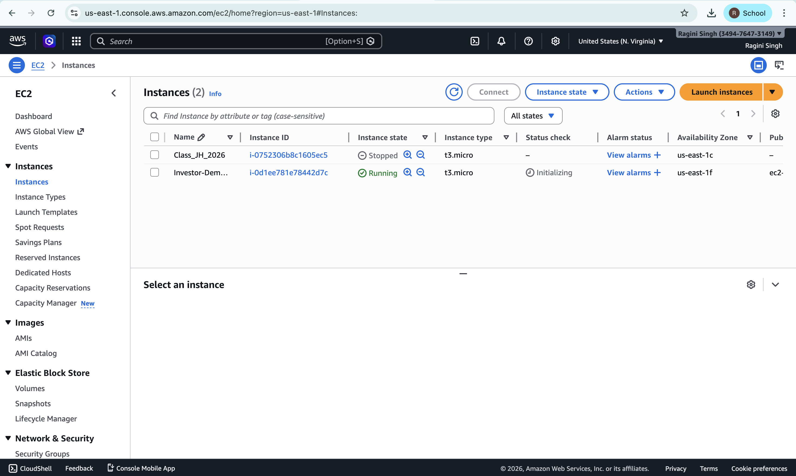

---

## EC2 Terminal Connected

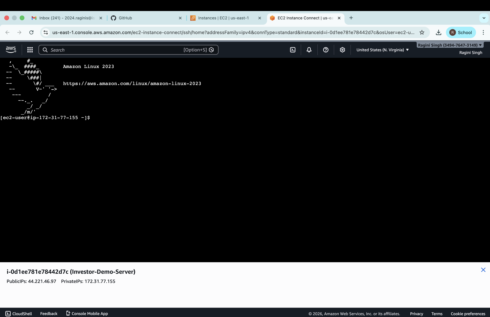

---

## Server Update

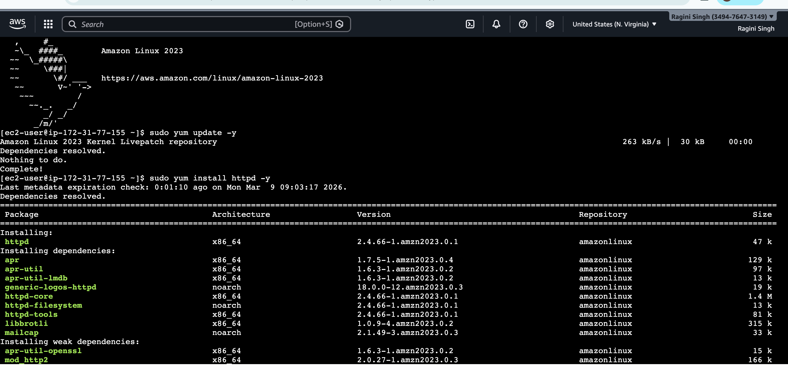

---

## Apache Installation

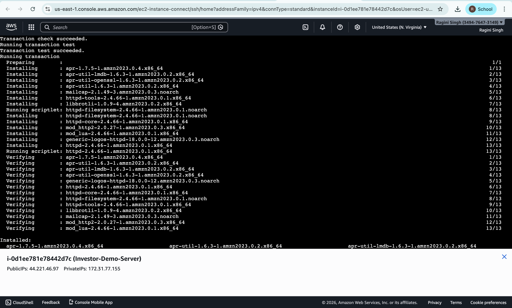

---

## Apache Started

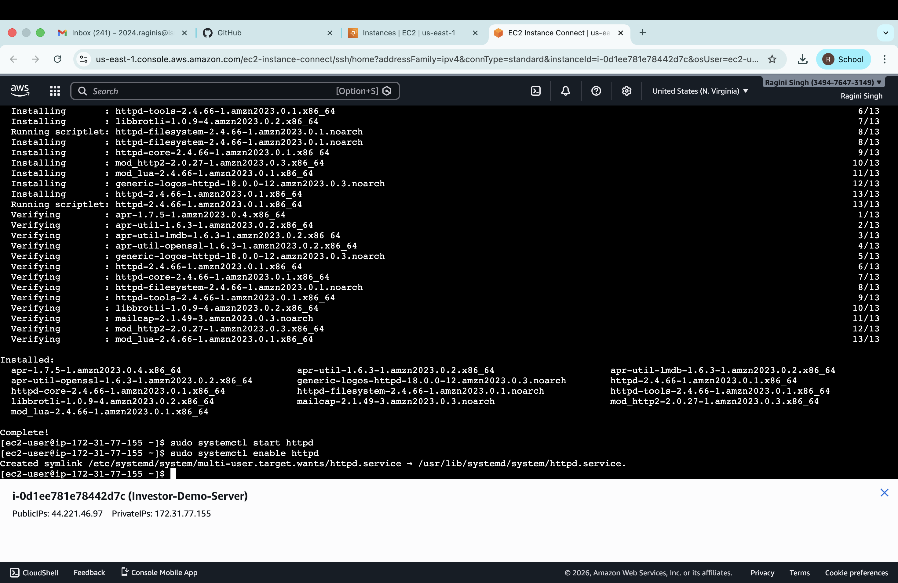

---

## EC2 Terminal Commands

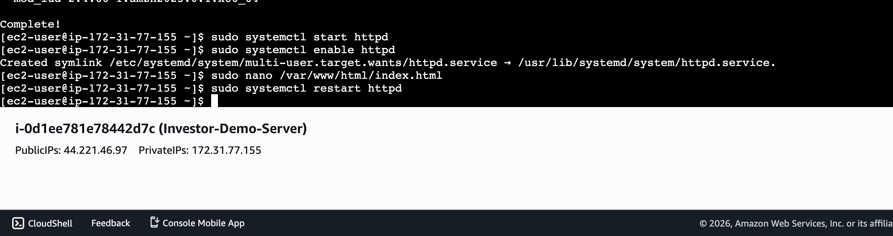

---

## Website Live

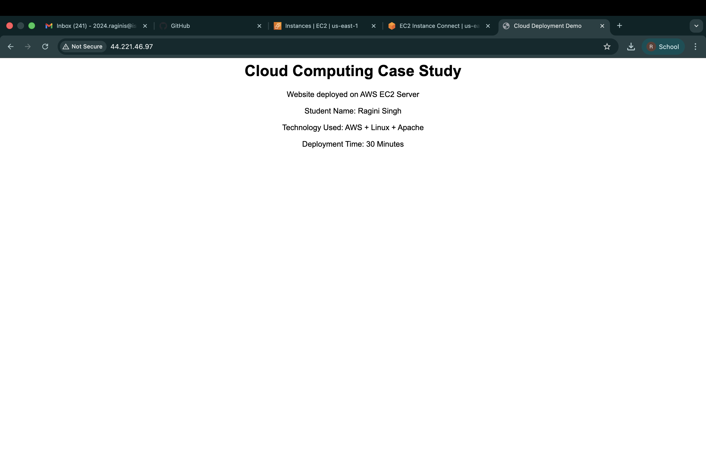

---

# Project Files

```
README.md
index.html
Screenshot/
PS71_Cloud_Computing_Case_Study_Ragini_Singh.pdf
```

---

# Conclusion

This case study demonstrates how cloud computing enables rapid deployment of applications.

Using AWS EC2, a virtual server was created, configured with Apache web server, and a simple HTML website was successfully deployed and accessed via a public IP address.

---

# Author

**Ragini Singh**
Cloud Computing Case Study Project
